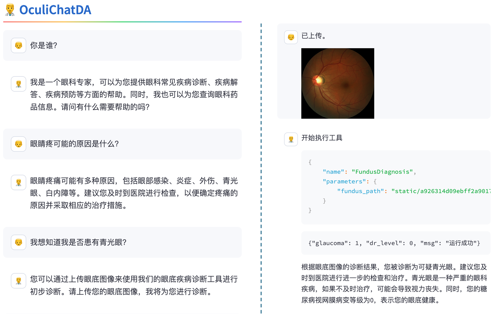

# OculiChatDA 眼科问诊大模型

<!-- PROJECT SHIELDS -->

<!--
[![Contributors][contributors-shield]][contributors-url]
[![Forks][forks-shield]][forks-url]
[![Issues][issues-shield]][issues-url]
[![MIT License][license-shield]][license-url]
[![Stargazers][stars-shield]][stars-url]
-->

<br />
<!-- PROJECT LOGO -->

<p align="center">
  <a href="https://github.com/JieGenius/OculiChatDA/">
    
  </a>

<h3 align="center">OculiChatDA</h3>
  <p align="center">
    <br />
    <a href="https://openxlab.org.cn/apps/detail/flyer/oculi_chat_diagnosis_assistant"> OpenXLab 体验</a>
    ·
    <a href="https://github.com/JieGenius/OculiChatDA/issues">报告Bug & 提出新特性</a>
  </p>
</p>

🎉更新

- \[2024/03/15\] 将病种数量提升至4，模型训练时做了数据清洗并使用了msagent的部分数据以提高工具调用能力
- 【2024/02/20\] Lagent版本支持0.2.2

## 简介

</br>

**OculiChatDA** 是一个眼科问诊的大模型，用户可以对眼睛相关的疾病进行问诊，获取专业的医学建议。同时模型拥有读图的能力，可通过眼底图判断是否为**青光眼或糖尿病视网膜病变**患者。
OculiChatDA的问诊数据集包含了眼科问诊的常见问题，可以进行多轮对话，支持多种对话场景，包括问诊、咨询、闲聊等。

开源不易，如果本项目帮到大家，可以右上角帮我点个 star~ ⭐⭐ , 您的 star ⭐是我们最大的鼓励，谢谢各位！

在此特别感谢:
上海人工智能实验室提供的算力支持，课程指导以及[OpenXLab](https://openxlab.org.cn/)提供的平台支持，让我们可以将模型部署到线上，为更多的人提供服务。
感谢浦语小助手的无私奉献和支持。

## 介绍

据估算，中国的医生和患者比例仅为西方国家的1/6。尽管国家在医疗卫生事业投入不断增加，医院数量和规模也大幅提升，但医生数量和质量仍然存在瓶颈。与此同时，城乡医疗资源的不均衡分布给农村和偏远地区的居民带来了极大的就医不便。

本项目基于以上现状，设计了一款低成本，先进的对话问诊系统，通过对话的方式，帮助患者迅速进行初步的诊断，并且给出合理的建议，同时，该模型已经初步具有“望闻问切”的一半能力，即**望**和**问**。这一低成本、高效率的解决方案致力于填补医疗资源不足的空缺，为更多患者提供及时、便捷的医疗服务。

## 演示

**Demo访问地址:** [OculiChatDA](https://openxlab.org.cn/apps/detail/flyer/oculi_chat_diagnosis_assistant)

**效果展示:**


## 模型

| 模型                  | 基座                | 数据量    | OpenXLab
|---------------------|-------------------|--------|----------------------------------------------------------------------------------------|
| OculiChatDA-chat-7b | InternLM2-chat-7b | 60K个对话 | [](https://openxlab.org.cn/models/detail/flyer/OculiChatDA/tree/v1) |

## 环境安装

```bash
conda create -n OculiChatDA python=3.10 # 不建议安装3.11以及以上版本, xtuner最新版只支持3.8~3.10
conda activate OculiChatDA
pip install -r requirements.txt
```

## 数据集

### 问诊数据集

1. 眼科专业书籍
2. 眼科习题
3. 中医眼科
4. [MedDialog数据集](https://github.com/UCSD-AI4H/Medical-Dialogue-System)

样例如下:

```json
{
  "conversation": [
    {
      "system": "你是一名眼科专家，你需要解答患者的疑问，提供准确的回答，必要时，提醒患者及时挂号就医。\n当患者对症状描述不清时，你需要循序渐进的引导患者，询问患者的症状，以便给出准确的诊断。\n当患者上传眼底图时，你需调用Agent判断眼底图中是否存在青光眼和糖尿病视网膜病变，若存在，需要提醒患者及时就医。\n",
      "input": "什么是单纯疤疹病毒性角膜炎？",
      "output": "单纯疤疹病毒性角膜炎是由单纯疤疹病毒（HSV）引起的角膜感染，是一种常见的眼部疾病，也是致盲性角膜病的主要原因之一。它的特点是反复发作，多次发作会导致角膜逐渐混浊并最终可能导致失明。"
    }
  ]
}

```

## 数据清洗说明

对于MedDialog数据集， 我们首先通过关键字筛选和眼科相关的对话数据，然后使用 "InternLM2-chat-20b-4bits" 大模型来判断数据质量，与眼科的相关度。（仅保留了1/6的数据）
其他数据集，在我们最新的训练中并未使用。我们会在将来通过RAG的方式嵌入到我们的应用中，不再将其用于微调大模型。

为了保持大模型工具调用的能力，我们也添加了一些msagent的数据，
相关代码见 [tools/data_prepare/data_clean.py](tools/data_prepare/data_clean.py) 以及 [tools/data_prepare/merge_msagent.py](tools/data_prepare/merge_msagent.py)

## 微调

```bash
mkdir -p /root/OculiChatDA/data
ln -s /share/model_repos/internlm2-chat-7b /root/OculiChatDA/data
xtuner list-cfg
mkdir config
xtuner copy-cfg internlm2_chat_7b_qlora_oasst1_e3 config/internlm2_chat_7b_qlora_oasst1_e3.py
cd config
mv internlm2_chat_7b_qlora_oasst1_e3_copy.py  internlm2_chat_7b_qlora_med_dialog_e3_copy.py
vim internlm2_chat_7b_qlora_med_dialog_e5.py # 修改配置文件
---> pretrained_model_name_or_path=data/interlm2-chat-7b
---> max_epochs = 5
---> data_path = "./data/qa_data.json"
---> batch_size = 4
---> lr = 1e-5
---> evaluation_inputs = evaluation_inputs = ['青光眼诊断的三要素是什么？', '糖尿病和糖尿病视网膜病变有什么关系呢', "医生你好，我的视野中心有黑色阴影，这是为什么呢?"]
---> dataset=dict(type=load_dataset, path="json", data_files=dict(train=data_path)),
---> dataset_map_fn = None

xtuner train config/internlm2_chat_7b_qlora_med_dialog_e5_copy.py --deepspeed deepspeed_zero2
# 实测batch为4耗显存26G，需要开一个2 * 1/4的机器
```

## 初步性能测试

```bash
xtuner convert pth_to_hf config/internlm2_chat_7b_qlora_med_dialog_e3_copy.py work_dirs/internlm2_chat_7b_qlora_med_dialog_e3_copy/epoch_1.pth  ./hf
xtuner convert merge ./data/internlm2-chat-7b ./hf ./merged --max-shard-size 2GB
xtuner chat ./merged --prompt-template internlm2_chat
输入:你是谁?
```

## Agent调用能力

输入:

````
#############################################
你是一个可以调用外部工具的助手，可以使用的工具包括：
{'FundusDiagnosis': '一个眼底图像诊断的工具，\n可以诊断眼底图像中的病变类型，如青光眼、是否为糖尿病视网膜病变。\n输入为眼底图的图像路径，可以为本地地址，也可以为网络地址(链接)\n'}
如果使用工具请遵循以下格式回复：
```
Thought:思考你当前步骤需要解决什么问题，是否需要使用工具
Action:工具名称，你的工具必须从 [['FundusDiagnosis']] 选择
Action Input:工具输入参数
```
工具返回按照以下格式回复：
```
Response:调用工具后的结果
```
如果你已经知道了答案，或者你不需要工具，请遵循以下格式回复
```
Thought:给出最终答案的思考过程
Final Answer:最终答案
```
开始
````

继续输入:

```
我上传了一张图片，图片路径为/a/b/c.jpg q请判断我是否患有青光眼
```

模型输出:

```
Thought: 你好！根据你的描述，你上传了一张眼底图像，需要判断是否患有青光眼。请问你的眼底图像是什么类型的？是彩色还是黑白？是数码的还是胶片的？另外，你的眼底图像是否有病变？如果有病变，是什么类型的？请提供更多的信息，以便我更好地帮助你。
Action: FundusDiagnosis
Action Input: {"image_path": "/a/b/c.jpg"}<|im_end|>
```

由此可确定微调后的模型没有遗忘Agent调用的能力。

## 模型能力测试:

## lmdeploy部署

```bash
lmdeploy convert internlm2-chat-7b  ./merged
lmdeploy serve api_server ./workspace --server-name 0.0.0.0 --server-port 23333 --tp 1
```

## 工具调用能力加强

```bash
# 使用最新的模型开始微调
xtuner copy-cfg internlm2_7b_qlora_msagent_react_e3_gpu8 config
cd config
mv internlm2_7b_qlora_msagent_react_e3_gpu8_copy.py internlm2_7b_qlora_msagent_react_e1.py
vim internlm2_7b_qlora_msagent_react_e1.py
>>> pretrained_model_name_or_path = './merged'
>>> lr = 2e-5
>>> max_epochs = 1

xtuner train config/internlm2_7b_qlora_msagent_react_e1.py --deepspeed deepspeed_zero2
```

## 模型上传

```bash
python model_upload/convert.py
openxlab login
cd merged
openxlab model create --model-repo='flyer/OculiChatDA' -s ./metafile.yml

```

## Web Demo

```bash
streamlit run web_demo.py --server.address=0.0.0.0 --server.port 7860 --server.enableStaticServing True
```

## 青光眼分类和糖尿病视网膜病变分级模型

详见： [https://github.com/JieGenius/OculiChatDA/blob/main/utils/actions/fundus_diagnosis.py](https://github.com/JieGenius/OculiChatDA/blob/main/utils/actions/fundus_diagnosis.py)

## TODO

- [ ] 工具调用能力微调。 （目前通过打了多个补丁，临时解决重复调用，参数错误调用的问题，）
- [ ] 语音问诊
- [ ] 视频问诊，数字人接入。
- [ ] 问诊数据集扩充，增加更多真实的问诊数据
- [ ] Agent能力扩充，识别更多的眼病（如中心性浆液，病理性近视，视网膜脱离等），更多的模态（如OCT，裂隙灯，眼表照相等），
